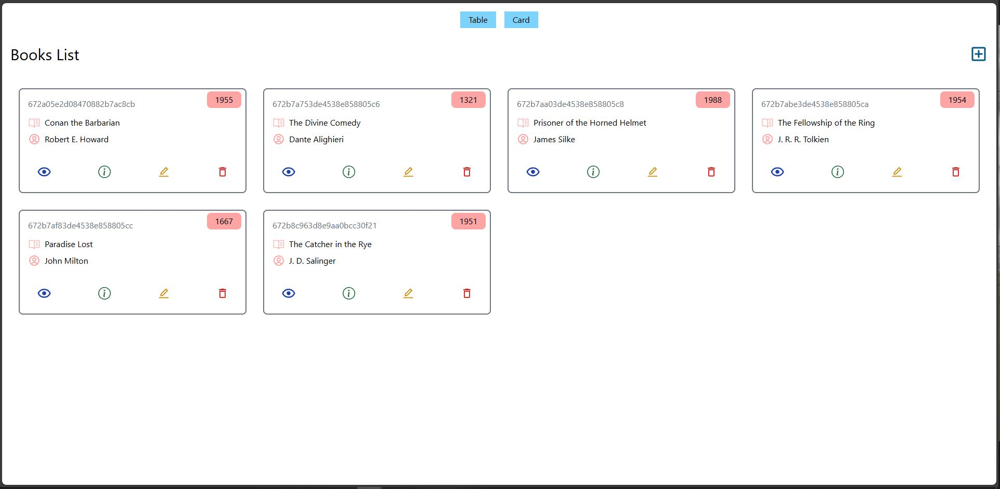
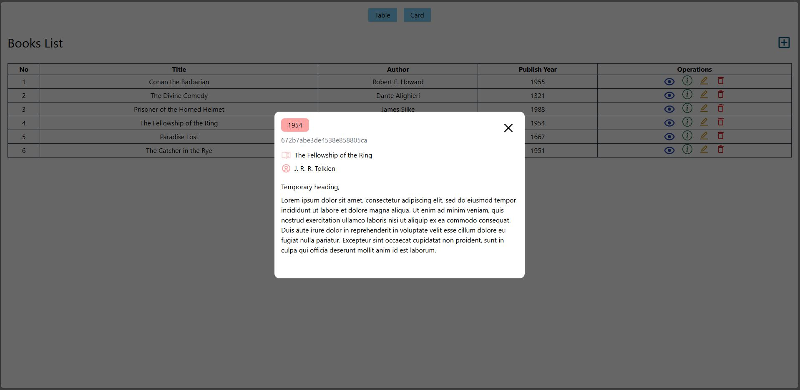

# Full stack - Book library app.

---

### Description

This project is a full-stack book library application built using the MERN (MongoDB, Express.js, React.js, Node.js) tech stack. It was developed as a learning exercise to deepen my understanding and gain experience in full-stack development, particularly with MongoDB and Express.js. The project was done with this [YouTube tutorial](https://www.youtube.com/watch?v=-42K44A1oMA&t=234s) by the channel _freeCodeCamp\.org_. Though several features have been disabled for hosting on GitHub pages, the application allows users to view the library in table or card views, add/edit/delete books, and view book information via page or modal.

### Screenshots

  
  &nbsp; &nbsp; &nbsp; &nbsp;
  

(_full size images can be found [here](./screenshots)_)

### Functionality

- View the library of books in either a table or card format.
- Create new books (disabled for this demonstration).
- Delete books (disabled for this demonstration).
- Edit books (disabled for this demonstration).
- View individual books' information.
- View book information via a po-up modal.

### Modifications

The focus of this project was learning about the MERN stack and gaining experience with new technologies so the only modifications made were:

- The addition of the modal to the table view.
- Modification of the app. to allow the project to be effectively hosted on GitHub (replacing the backend with the data.json file and the disabling of functionality).

### Requirements

- A web browser
- Node.js
- git

### How to use

To use the application, you can either go [here](https://luke663.github.io/mern-bookstore/) to see the app. hosted via GitHub pages or host it locally by completing the following steps:

- Clone the application.
  - Open a command terminal
  - Go to the directory on your computer where you wish to put the repository.
  - Run the commands:
    - git clone https\://github\.com/Luke663/mern-bookstore
    - cd mern-bookstore
    - npm install
- Run the application.
  - Run the command:
    - npm run dev
  - Click (or copy and paste into a browser) the local address that appears in the terminal.

### License

This is a demonstration project and not intended for collaboration, as such a license has not been added meaning the default copyright laws apply and no one may reproduce, distribute, or create derivative works from this work.
